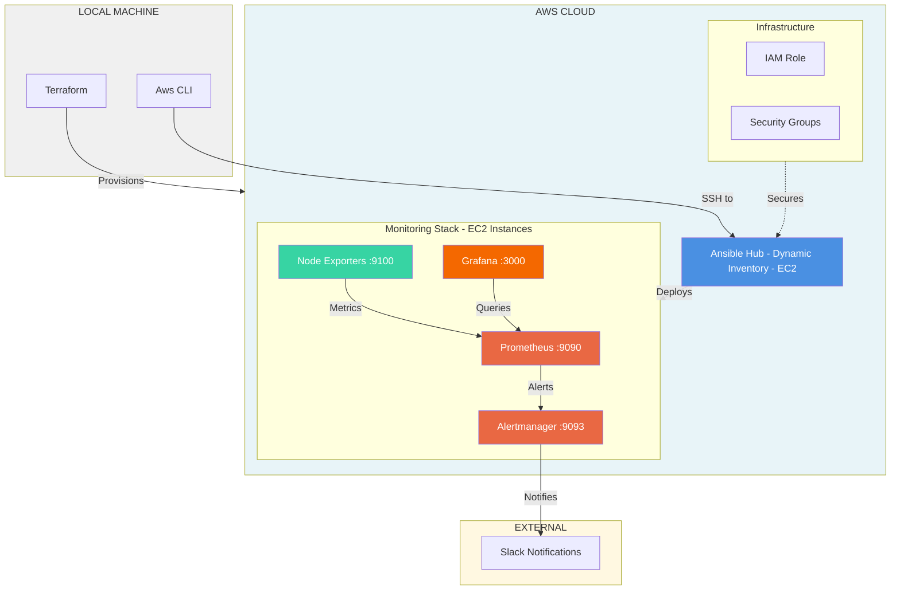

# End-to-End Monitoring with Ansible & Terraform

A fully automated infrastructure and monitoring solution that provisions AWS EC2 instances using Terraform and configures a complete monitoring stack (Prometheus, Alertmanager, Grafana, Node Exporter) using Ansible.

## Architecture Diagram



## Features

### Infrastructure Automation

- **Terraform-managed AWS Resources**: Automated provisioning of EC2 instances, IAM roles, security groups, and SSH keys
- **Dynamic Inventory**: AWS EC2 plugin for automatic host discovery based on tags
- **Secure Access**: Automated SSH key distribution and passwordless sudo configuration

### Monitoring Stack

- **Prometheus**: Time-series metrics collection and storage with 2-day retention
- **Alertmanager**: Centralized alert management with Slack integration
- **Grafana**: Real-time data visualization and dashboards
- **Node Exporter**: System-level metrics collection from all target hosts

### Configuration Management

- **Ansible Roles**: Modular, reusable role-based configuration
- **Service Resilience**: Health checks with automatic retry logic (15 retries, 10s delay)
- **Systemd Integration**: All services managed via systemd with auto-restart capabilities

## Infrastructure Setup

### Prerequisites

- **AWS Account** with CLI configured (`aws configure`)
- **Terraform** >= 6.0

### Components

1. **Ansible Hub EC2**: Central control node that runs Ansible playbooks against target hosts
2. **Target EC2 Instances**: Hosts where the monitoring stack is deployed
3. **Local Machine**: The Machine that runs the initial Terraform code (needs Prerequisites installed in it)

## How to Run

### 1. Clone the Repository

```bash
git clone https://github.com/Arijit9721/End-To-End-Monitoring-Setup-With-Ansible.git
cd End-To-End-Monitoring-Setup-With-Ansible/Terraform
```

### 2. Configure Terraform Variables

Edit `Terraform/terraform.tfvars`:

```hcl
region                  = ""
ami                     = ""
ansible_instance_type   = ""
worker_instance_type    = ""
spoke_count             = 0
environment             = ""
key_location            = ""   # folder to keep the ssh keys
```

### 3. Deploy Infrastructure with Terraform From your Local Machine

```bash
terraform init
terraform plan
terraform apply
```

**Note**: Save the output - you'll need the Ansible Hub public IP to SSH into it.

### 4. SSH into Ansible Hub

```bash
ssh -i /path/to/main-key.pem ubuntu@<ansible-hub-public-ip>
sudo su - ansible
cd /home/ansible/Ansible_folder/Ansible
```

### 5. Configure Alertmanager (Optional)

Edit `roles/alertmanager/files/alertmanager.yaml` and add your Slack webhook URL:

```yaml
receivers:
  - name: "slack-notifications"
    slack_configs:
      - api_url: "https://hooks.slack.com/services/YOUR/SLACK/WEBHOOK"
```

### 6. Run Ansible Playbook

```bash
ansible-playbook -i inventory/aws_ec2.yaml playbook.yaml
```

### 7. Access Monitoring Dashboards

- **Prometheus**: `http://<target-instance-ip>:9090`
- **Alertmanager**: `http://<target-instance-ip>:9093`
- **Grafana**: `http://<target-instance-ip>:3000` (default credentials: `admin/admin`)
- **Node Exporter Metrics**: `http://<target-instance-ip>:9100/metrics`
